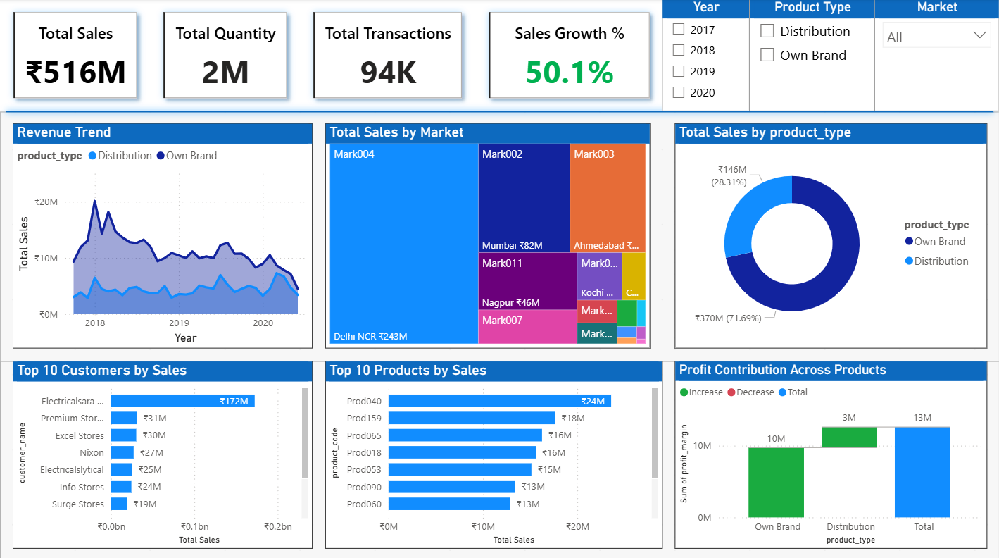
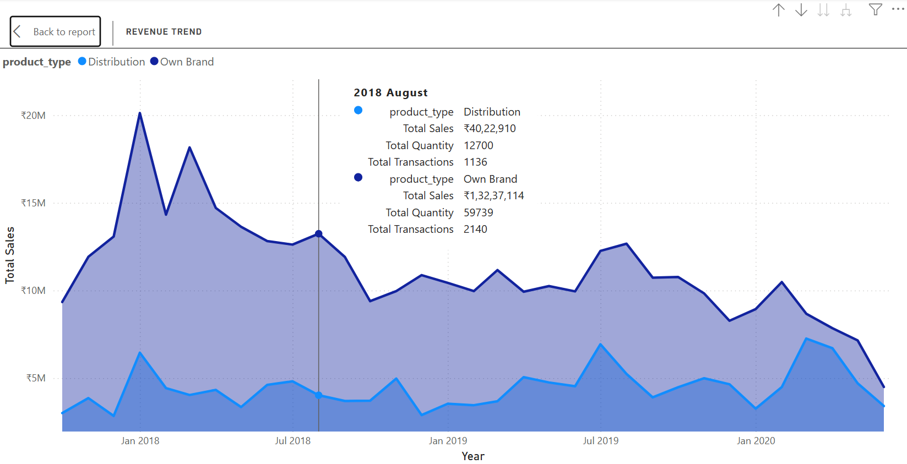
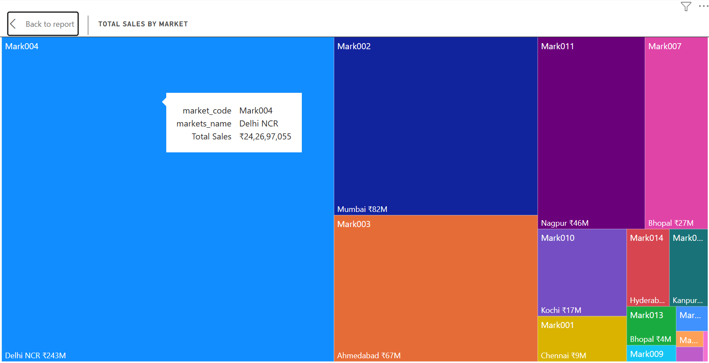
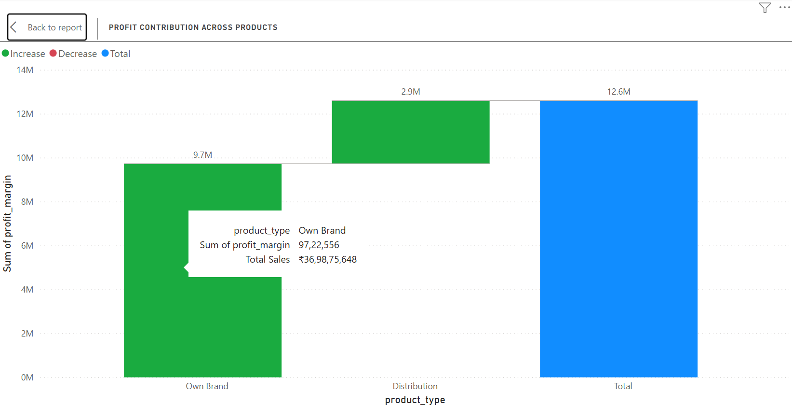
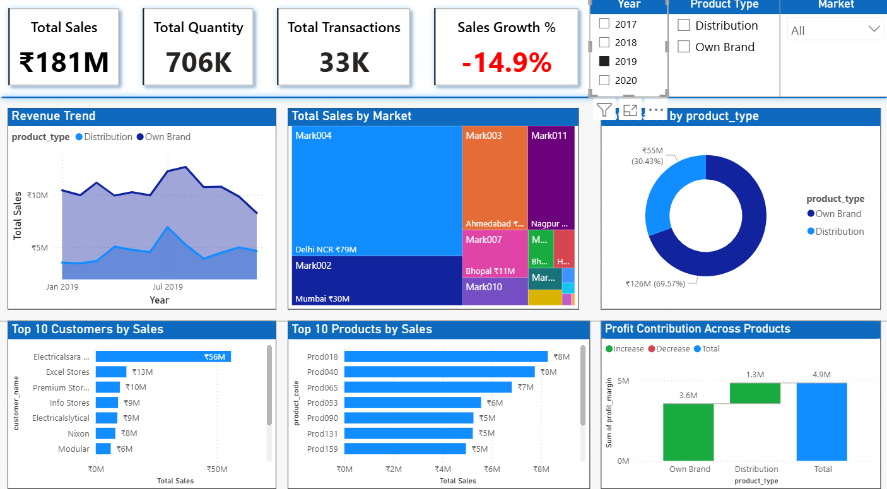
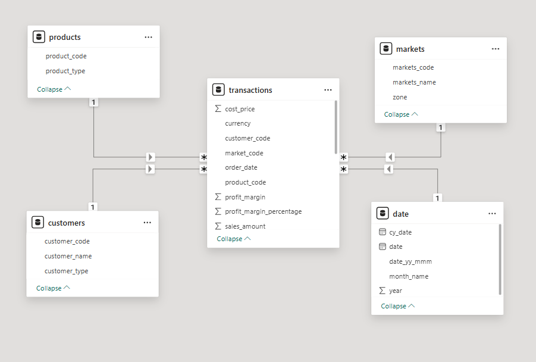

# 📊 Sales Insights Performance Analysis

## Project Overview

The **Sales Insights Dashboard** provides a comprehensive view of the company’s sales performance, profit, and customer trends. It helps stakeholders quickly analyze revenue trends, product performance, customer contributions, and profit distribution, enabling better business decisions.

---

## Data Source

The dashboard is built using **5 tables** from the database:

* **Transactions** – Contains sales transactions, profit margin, quantity, cost, and order details.
* **Products** – Contains product codes, product types, and other product-related information.
* **Customers** – Contains customer codes and customer names.
* **Markets** – Contains market codes and market names.
* **Date Table** – Contains date information to support time-based analysis (Year, Month, etc.).

---

## Dashboard Layout

### 1️⃣ KPIs (Top Row)

* **Total Sales**
* **Total Quantity Sold**
* **Total Transactions**
* **Sales Growth %**

**Slicers:**

* **Year (Vertical)**
* **Product Type (Vertical)**
* **Market (Dropdown)**

---

### 2️⃣ Middle Section (Charts)

* **Revenue Trend** – Line chart showing sales over time.
* **Total Sales by Market** – Treemap showing revenue contribution by each market.
* **Total Sales by Product Type** – Donut chart showing sales share by product type.

---

### 3️⃣ Bottom Section (Charts)

* **Top 10 Customers by Sales** – Bar chart highlighting highest-revenue customers.
* **Top 10 Products by Sales** – Bar chart showing the most sold products.
* **Profit Contribution Across Products** – Waterfall chart showing how individual products contribute to total profit.

---

## Insights

1. **Sales & Profit by Product Type**

   * **Own Brand** dominates both sales and profit, contributing **71.69% of total sales** and **77.17% of total profit**.
   * **Distribution** products contribute **28.31% of sales** and **22.83% of profit**.
     📌 *Insight:* The company heavily relies on Own Brand products for revenue and profitability.

2. **Top Customer Contribution**

   * **Electricalsara Stores** alone contributes **33.42% of total revenue**.
   * The **top 3 customers together account for \~45% of sales**, indicating high dependence on a few customers.
     📌 *Insight:* The company should consider strategies to diversify its customer base to reduce concentration risk.

3. **Profit Contribution Across Products**

   * Products with higher individual profit margins may not always have the highest sales.
   * The **profit waterfall chart** highlights which products contribute most to overall profit, showing opportunities to optimize the product mix.
     📌 *Insight:* Focusing on high-margin products could improve overall profitability.

---

## Project Screenshots & Demo Video

1. **Full Dashboard**  
   

2. **Revenue Trend (Line Chart)**  
   

3. **Total Sales by Market (Treemap)**  
   

4. **Profit Contribution Across Products (Waterfall Chart)**  
   

5. **Filtered View: Year 2019 (Sales Growth % -14.9%)**  
   

6. **Model View (Relationships Between Tables)**  
   

7. **Dashboard Demo Video**
   <video width="600" controls>
      <source src="screenshots/Sales_Insights_Dashboard_Demo.mp4" type="video/mp4">
      Your browser does not support the video tag.
   </video>

   [Watch Dashboard Demo](screenshots/Sales_Insights_Dashboard_Demo.mp4)

8.**Dashboard Preview**
   

---

## SQL Queries
All SQL queries used to generate the data for the dashboard are saved in **Sales_Insights_Queries.sql**. This file includes:

- Database and table exploration
- Data quality checks (NULLs, orphan records)
- Currency checks and updates
- Exploratory data analysis (total sales, quantity, trends)
- Top products and product types
- Top customers
- Market-wise sales distribution

---

## File Structure
```
Sales_Insights_Project/
│
├── Sales_Insights_Dashboard.pbix           # Power BI Dashboard
├── Sales_Insights_Queries.sql              # SQL queries for data extraction
├── README.md                               # Project documentation
└── screenshots/
    ├── dashboard_full.png                  # Full Dashboard Screenshot
    ├── revenue_trend.png                   # Revenue Trend Line Chart
    ├── sales_by_market.png                 # Total Sales by Market Treemap
    ├── profit_waterfall.png                # Profit Contribution Waterfall Chart
    ├── slicer_2019.png                     # Filtered View 2019 Screenshot
    ├── data_model.png                      # Model View
    └── Sales_Insights_Dashboard_Demo.mp4   # Dashboard Demo Video
```

---
